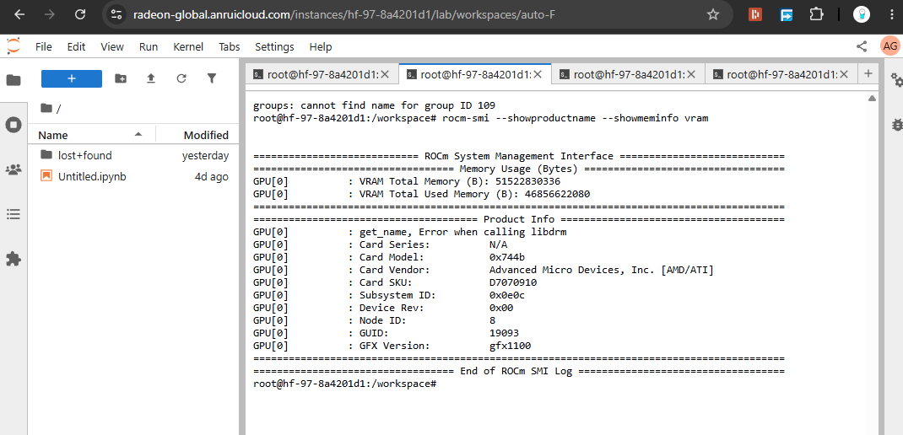

# WasteWise

**Predicts ingredient demand, benchmarks supplier costs against live market data, and drafts the purchase order — cutting over-ordering and food waste.**

A restaurant uploads its sales history. WasteWise forecasts how much of each item it will need, an LLM agent adjusts those numbers for weather and holidays (with a plain-language reason per item), a second agent benchmarks supplier prices and picks the best listing, and the result is a drafted purchase order a human approves and exports.

```
sales history → forecast → agent adjusts & explains → agent sources & prices → drafted PO
```

Built for the [AMD Developer Hackathon: ACT II](https://lablab.ai/ai-hackathons/amd-developer-hackathon-act-ii) (Unicorn track).

## Live demo

- **App:** https://wastewise-theta.vercel.app — deployed on Vercel
- **API:** https://wastewise-backend.onrender.com ([health](https://wastewise-backend.onrender.com/health)) — free tier, first request may cold-start ~30–60 s
- **Demo video (~90 s):** <!-- TODO: add video link -->
- **Slide deck (PDF):** <!-- TODO: add deck link/path -->

## How this was built with AI

This was built session-by-session with Claude Code: each unit of work started as a written plan, got implemented and tested, then a separate review pass checked the diff before merge. The docs are committed, not summarized after the fact:

- **Specs** (what to build, and why): [`docs/specs/`](docs/specs)
- **Plans** (task-by-task implementation breakdowns, one per feature/fix): [`docs/plans/`](docs/plans), [`docs/superpowers/plans/`](docs/superpowers/plans)
- **Reviews** (what was checked before merging, and what was wrong): [`docs/reviews/`](docs/reviews)

Two concrete examples of catching and fixing AI-produced mistakes, not just accepting output:

- **A silently 100%-broken pipeline.** On 2026-07-10 a debugging session found that `/forecast` and `/sourcing` had *never* made a single successful LLM call — the shipped dev `LLM_MODEL` id 404'd against Fireworks, so both agents had been running on deterministic fallback text the whole time with no visible error. The same investigation caught two more silent failures: a dead USDA API credential, and a Kroger retail adapter that grabbed the first blind search match (`filter.limit=1`) instead of the right one, sometimes pricing a specialty SKU instead of the plain commodity and silently returning $0.00 on no-match. Root cause, fix plan, and the fix itself are in [`docs/superpowers/plans/2026-07-10-wastewise-ai-fixes.md`](docs/superpowers/plans/2026-07-10-wastewise-ai-fixes.md) — including the decision to run dev against local Ollama on the *same* Mistral model the AMD box serves, specifically so model-specific quirks surface in dev instead of during the live demo.
- **A pre-submission readiness review that changed the plan.** [`docs/reviews/2026-07-11-hackathon-readiness-review.md`](docs/reviews/2026-07-11-hackathon-readiness-review.md) is an AI-run audit against the hackathon's actual judging criteria, done the day of the deadline. It correctly flagged that the engineering was done (78/78 backend tests, 43/43 frontend) but the submission would still fail pre-screening — no demo video, no deck, a suspended hosted backend, and a GPU-name inconsistency between the spec and the actual `rocm-smi` evidence (W7900, not the MI300X earlier docs assumed). That review's priority list is what got worked through last, not the code.

## How it works

1. **Setup** — upload a sales CSV (`date, item, quantity, price?`) or use the bundled demo dataset; pick a location on the map (drives weather and regional prices) and a horizon (day/week).
2. **Forecast** — an XGBoost model forecasts per-item demand, backtested against a seasonal baseline on a 7-day holdout (the improvement is shown on screen, measured, not asserted). The adjustment agent then revises each item for the forecast weather and upcoming holidays, with a one-sentence reason per item.
3. **Sourcing** — each item is priced against live retail listings (Kroger API) and a US retail average benchmark (BLS via FRED). The sourcing agent picks the best plain-commodity listing among the candidates and explains the choice.
4. **Order** — a drafted purchase order with line totals, total, savings vs. benchmark, and an agent-written purchasing rationale. Approve and export to CSV.

Every AI-generated figure carries a `live` flag: when the model is unreachable, the UI says so instead of faking a reason.

## Architecture

```
Next.js frontend (Vercel)
  Setup → Forecast → Sourcing → Order
        │ REST (JSON)
        ▼
FastAPI backend
  forecast engine   XGBoost + seasonal baseline, per item
  agent steps       adjustment · sourcing selection · PO rationale
  data adapters     open-meteo weather · US holidays · FRED/BLS prices · Kroger retail
  storage           SQLite
        │ OpenAI-compatible API
        ▼
vLLM on AMD Radeon PRO W7900 (ROCm)
```

Design choices that matter:

- **Structured pipeline, not free-roaming autonomy.** Data tools are called deterministically; the LLM makes the judgment calls (adjust, select, justify) with schema-validated JSON output. A purchasing agent that hallucinates a tool call drafts a wrong order.
- **Swappable adapters.** Every data source implements a common interface with a file cache and graceful fallback — other markets plug in without touching the agents.
- **The demo must not break.** External API failure → cache → seeded fallback; LLM failure → unadjusted forecast, honestly labeled. There is always a number on screen.

## AMD compute usage

Both LLM judgment steps — demand adjustment and supplier selection — run inference on an open model served by **vLLM on an AMD Radeon PRO W7900 (48 GB VRAM, RDNA3/gfx1100, ROCm)** on the AMD Developer Cloud, exposed through an OpenAI-compatible endpoint. The backend points at it with a single env var (`LLM_BASE_URL`) — no code change between dev and the AMD GPU path.



Full evidence (rocm-smi output, vLLM server logs, latency benchmark): [docs/AMD_USAGE.md](docs/AMD_USAGE.md). Step-by-step reproduction: see [Setup](#setup) below.

## Incoming Roadmap

- **Waste-photo feedback loop** — vision model estimates end-of-day bin waste to self-correct the forecast.
- **Recipe/BOM layer** — forecast dishes, roll up to ingredient purchase orders for full-service restaurants.
- **Deep-learning forecaster** — PyTorch time-series (LSTM/TFT) trained on AMD GPUs.
- **Accounts & persistence** — multi-restaurant history and order tracking.

## Setup

### Run locally

Backend:

```bash
cd backend
pip install -e ".[dev]"
cp .env.example .env   # point LLM_BASE_URL at vLLM (or any OpenAI-compatible endpoint)
uvicorn wastewise.api:app --reload
```

Frontend:

```bash
cd frontend
npm install
cp .env.example .env.local   # set NEXT_PUBLIC_API_URL
npm run dev
```

Tests: `pytest -q` in `backend/` (78 tests), `npm test` in `frontend/` (43 tests).

Deployment runbook (Render + Vercel + the AMD box): [docs/DEPLOY.md](docs/DEPLOY.md).

### Reproducing the AMD GPU setup

The AMD box (`notebooks.amd.com/hackathon`, ROCm 7.2 + vLLM image) has **no
inbound network access** — only the JupyterLab terminal is reachable, and
there's no SSH/open port to the outside world. So the model is served
locally on the box, then tunneled out. Full gotcha-by-gotcha detail (CA
cert fixes, Python interpreter pitfalls, stable-subdomain tunnels) lives in
[docs/AMD_RUNBOOK.md](docs/AMD_RUNBOOK.md) — this is the condensed path.

**1. Serve the model on the GPU**, in a JupyterLab terminal:

```bash
vllm serve mistralai/Mistral-7B-Instruct-v0.3 --port 8000
```

Use `mistralai/Mistral-7B-Instruct-v0.3`, not a gated repo like
`meta-llama/Llama-3.1-8B-Instruct` — gated models 401 without an approved
HF token. Mistral is open-access and fits comfortably in 48 GB VRAM.

**2. Confirm it's really on the AMD GPU**, in another terminal:

```bash
curl localhost:8000/v1/models          # model answers locally
rocm-smi --showproductname --showmeminfo vram
```

Look for `Card Vendor: Advanced Micro Devices, Inc. [AMD/ATI]`, `GFX
Version: gfx1100`, and VRAM used climbing once the model loads.

**3. Expose port 8000 publicly.** `cloudflared` is the obvious first choice,
but on this box its binary download silently produces a 0-byte file (the
release CDN is blocked while `github.com` itself resolves) — check with
`file ~/cloudflared` before trusting it. If it's empty, use **ngrok**
instead, since its own CDN isn't blocked:

```bash
pip install pyngrok
```

Get a free authtoken from https://dashboard.ngrok.com/get-started/your-authtoken,
then open (and leave running in) its own terminal:

```bash
python3 <<'EOF'
from pyngrok import ngrok, conf
conf.get_default().auth_token = "YOUR_TOKEN_HERE"
tunnel = ngrok.connect(8000, "http")
print(tunnel.public_url)
ngrok.get_ngrok_process().proc.wait()   # blocks so the tunnel stays up
EOF
```

This prints a public `https://<random>.ngrok-free.dev` URL. (A plain SSH
reverse tunnel — `ssh -R 80:localhost:8000 nokey@localhost.run` — also works
with zero install if ngrok is unavailable, but hands out a new random
subdomain every reconnect.)

**4. Verify from your own machine** (not the box) before wiring anything up:

```bash
curl https://<your-tunnel-url>/v1/models
```

**5. Point the deployed backend at it.** In the Render dashboard, set:

```
LLM_BASE_URL=https://<your-tunnel-url>/v1
LLM_MODEL=mistralai/Mistral-7B-Instruct-v0.3
LLM_API_KEY=dummy
```

Saving triggers a redeploy. Check the deploy logs for the boot banner —
`[ LLM LIVE ]` with the tunnel URL as endpoint confirms the deployed app is
really calling the AMD GPU, not silently running on fallback text.

**Keep the vLLM terminal and the tunnel terminal open** for as long as the
live demo needs to work — closing either one kills the chain, and most free
tunnel services hand out a new URL on reconnect, so `LLM_BASE_URL` on Render
would need updating again.

## License

[MIT](LICENSE)
